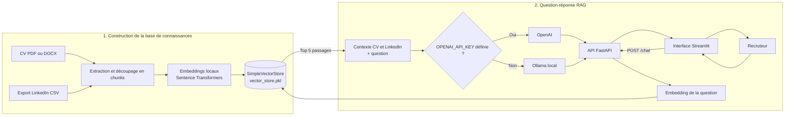

# Profile Career Chatbot

[](https://github.com/Valmdatascientest/profile_chatbot/actions/workflows/ci.yml)

## Présentation du projet

Profile Career Chatbot est un projet pédagogique visant à démontrer la mise en œuvre complète d’un chatbot de type RAG (Retrieval-Augmented Generation) appliqué à un cas concret de valorisation de profil candidat à partir d’un CV et d’un profil LinkedIn. L’objectif est de permettre à un recruteur de poser des questions et d’obtenir des réponses cohérentes, professionnelles et strictement basées sur les informations fournies. Le projet met l’accent sur la modularité, la reproductibilité et l’exécution locale, conformément aux bonnes pratiques attendues dans un cadre d’examen.

## Objectifs pédagogiques

- Comprendre et implémenter une architecture RAG complète  
- Mettre en œuvre des embeddings sémantiques locaux  
- Construire un pipeline de question-réponse contextualisé  
- Séparer clairement backend API et interface utilisateur  
- Gérer la configuration par variables d’environnement  
- Rendre le projet exécutable sans dépendance à une API externe  

## Architecture générale

L’application repose sur une architecture modulaire composée de deux parties principales : une API backend basée sur FastAPI et une interface utilisateur développée avec Streamlit.

```text
app/
├── api/          API FastAPI
├── chatbot/      Pipeline RAG et sélection du LLM
├── indexing/     Embeddings et vector store
├── ingestion/    Parsing CV et export LinkedIn
├── ui/           Interface Streamlit
└── config.py     Configuration centralisée
```

## Fonctionnement du pipeline RAG

1. La question de l’utilisateur est encodée à l’aide d’un modèle d’embeddings local.  
2. Les passages les plus pertinents sont récupérés depuis le vector store.  
3. Un contexte est construit à partir du CV et du profil LinkedIn.  
4. Le modèle de langage génère une réponse en français, à la première personne, exclusivement basée sur le contexte fourni.  

### Schéma de fonctionnement



## Modèle de langage

Le projet utilise un système de sélection automatique du modèle de langage. Par défaut, un modèle local via Ollama est utilisé sans API key. Si une variable d’environnement OPENAI_API_KEY est définie, OpenAI est utilisé automatiquement. Les embeddings sont toujours calculés localement, quel que soit le modèle de langage sélectionné. Ce choix garantit l’autonomie du projet et sa conformité aux contraintes d’examen.

## Prérequis techniques

- Python 3.10 ou supérieur  
- pip ou poetry  
- Machine standard avec CPU (GPU non requis)  
- Ollama recommandé pour l’exécution locale sans clé API  

## Installation locale

Cloner le dépôt puis installer les dépendances :

```bash
git clone https://github.com/Valmdatascientest/profile_chatbot.git
cd profile_chatbot
python -m venv .venv
source .venv/bin/activate
pip install -r requirements.txt
cp .env.example .env
```

Copier ensuite le CV dans `data/raw/cv.pdf` et l’export LinkedIn dans `data/raw/`, puis créer l’index :

```bash
python -m app.indexing.build_index \
  --cv-path ./data/raw/cv.pdf \
  --linkedin-dir data/raw \
  --output-dir data/processed
```

## Exécution sans API key (mode par défaut)

1. Installer Ollama depuis https://ollama.com  
2. Télécharger un modèle local :  
   ollama pull llama3.1:8b  
3. Lancer le service Ollama :  
   ollama serve  
4. Démarrer l’API :  
   `uvicorn app.api.main:app --reload`
5. Démarrer l’interface Streamlit :  
   `streamlit run app/ui/streamlit_app.py`

## Exécution avec Docker Compose

```bash
cp .env.example .env
docker compose --profile index up --build indexer
docker compose up --build api ui
```

L’API est disponible sur `http://localhost:8000/health` et l’interface Streamlit sur `http://localhost:8501`.

## Configuration

La configuration est centralisée via un fichier .env optionnel :

```env
OPENAI_API_KEY=  
LLM_MODEL=gpt-4.1-mini  
OLLAMA_BASE_URL=http://localhost:11434  
OLLAMA_MODEL=llama3.1:8b  
EMBEDDING_MODEL=sentence-transformers/all-MiniLM-L6-v2  
```

## Tests

```bash
python -m unittest discover -s tests
```

La CI GitHub exécute ces tests à chaque push et pull request.

## Données personnelles et sécurité

- Les fichiers de CV, exports LinkedIn et index vectoriels ne sont pas versionnés.
- Le fichier `.env` local ne doit pas être poussé.
- L’image Docker ne copie pas `data/` : les données personnelles sont montées via volume.
- Le fichier `vector_store.pkl` est généré localement. Il ne doit pas être chargé depuis une source non fiable.

## Critères d’évaluation couverts

- Architecture claire et modulaire  
- Séparation frontend et backend  
- Utilisation pertinente du NLP et des embeddings  
- Pipeline RAG fonctionnel  
- Exécution locale sans dépendance externe  
- Configuration propre et reproductible  

## Perspectives d’amélioration

- Remplacement du vector store simple par FAISS  
- Ajout d’une mémoire conversationnelle persistante  
- Conteneurisation avec Docker  
- Amélioration de l’interface utilisateur  
- Gestion multi-profils  

## Licence

 Libre d’utilisation.
